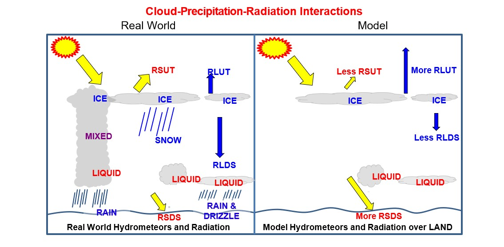

# Replication code for Kisembe et al., *Assessing the Impacts of Falling Ice Radiative Effects on the Seasonal Variation of Land Surface Properties*

This code replicates the analysis and figures in Kisembe et al. 2024, *Journal of Geophysical Research: Atmospheres*

This code is to be used in conjunction with the replication data at [doi.org/10.5281/zenodo.8092600](https://zenodo.org/records/10476872).

# Motivation

Coupled global climate models (GCMs) are widely used to study interactions between the atmosphere and the land surface. However, uncertainties remain in how these models represent clouds and frozen hydrometeors, including cloud fraction, cloud hydrometeor mass, falling hydrometeors (e.g., snow), and their radiative impacts on surface energy and hydrological processes.

Previous studies have shown that most models participating in the Coupled Model Intercomparison Project Phase 5 (CMIP5) did not include the radiative effects of falling ice (FIREs). Instead, these models accounted only for the radiative effects of cloud ice. In reality, however, radiation interacts with all frozen hydrometeors, including falling snow. 

The omission of FIREs in climate models may influence the simulated surface radiative budget and, consequently, affect land surface temperature and other surface processes. Such discrepancies in present-day simulations may also influence the reliability of future climate projections.

Following the framework of Li et al. (2016), this repository investigates the impacts of FIREs on land surface properties using the surface energy balance. The analysis uses sensitivity experiments from the Community Earth System Model Version 1 (CESM1) with the Community Atmosphere Model Version 5 (CAM5), comparing simulations with FIREs enabled and disabled.

The schematic below illustrates how radiative fluxes interact with frozen hydrometeors in the **REAL WORLD** compared to their representation in **CLIMATE MODELS**.

